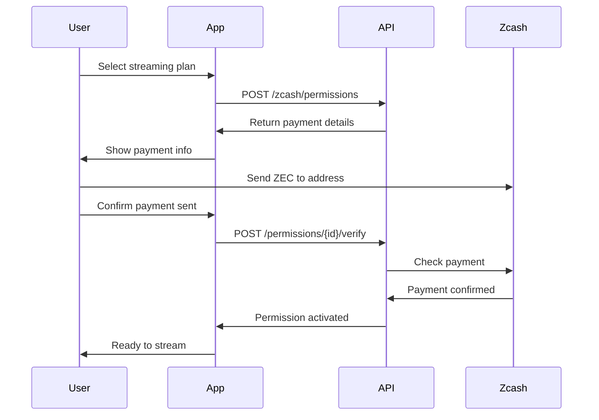
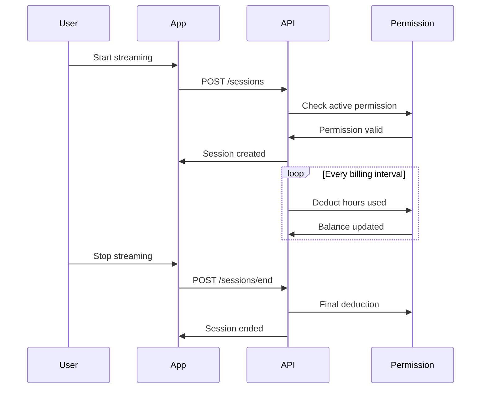

# PayGo Billing System with Zcash Integration

A comprehensive billing system for streaming services that integrates Zcash spending permissions, allowing users to pre-authorize spending limits and automatically calculate available streaming hours.

## Features

### Core Billing
- Real-time session management
- Automated billing intervals
- Multi-blockchain support (Ethereum + Zcash)
- Redis caching for performance
- PostgreSQL for persistent storage

### Zcash Integration
- **Spending Permission System**: Users authorize a spending limit upfront
- **Automatic Hour Calculation**: System calculates available streaming hours based on balance
- **Real-time Balance Tracking**: Monitors remaining balance and available hours
- **Permission Expiry Management**: Automatic expiration and renewal reminders
- **Hybrid Billing**: Falls back to direct blockchain billing if permissions are exhausted

## Architecture

```
┌─────────────────────────────────────────────────────────────┐
│                     Client Application                       │
└───────────────────────────┬─────────────────────────────────┘
                            │
                            ▼
┌─────────────────────────────────────────────────────────────┐
│                    PayGo API Gateway                         │
│  ┌──────────────┐  ┌──────────────┐  ┌──────────────┐      │
│  │   Sessions   │  │   Zcash      │  │   Billing    │      │
│  │   API        │  │   API        │  │   API        │      │
│  └──────────────┘  └──────────────┘  └──────────────┘      │
└───────────────────────────┬─────────────────────────────────┘
                            │
        ┌───────────────────┼───────────────────┐
        │                   │                   │
        ▼                   ▼                   ▼
┌──────────────┐   ┌──────────────┐   ┌──────────────┐
│  Integrated  │   │    Zcash     │   │  Blockchain  │
│   Billing    │──▶│   Service    │   │   Client     │
│   Engine     │   │              │   │  (Ethereum)  │
└──────────────┘   └──────────────┘   └──────────────┘
        │                   │
        ▼                   ▼
┌──────────────────────────────────────────────────────────┐
│                    PostgreSQL Database                    │
│  • Sessions  • Permissions  • Transactions  • Audit Logs │
└──────────────────────────────────────────────────────────┘
```

## Getting Started

### Prerequisites

1. **Rust** (1.70 or higher)
2. **PostgreSQL** (13 or higher)
3. **Redis** (6 or higher)
4. **Zcash Node** with RPC enabled
5. **Ethereum Node** (optional, for fallback)

### Installation

1. Clone the repository:
```bash
git clone https://github.com/
cd paygo-billing
```

2. Set up the database:
```bash
createdb paygo_billing
psql paygo_billing < migrations/20240101_initial_schema.sql
psql paygo_billing < migrations/20240101_zcash_permissions.sql
```

3. Configure environment variables:
```bash
cp .env.example .env
# Edit .env with your configuration
```

4. Build and run:
```bash
cargo build --release
cargo run --release
```

## API Documentation

### Zcash Permission Endpoints

#### 1. Create Spending Permission

Request user to authorize spending permission for streaming.

**Endpoint:** `POST /api/v1/zcash/permissions`

**Request Body:**
```json
{
  "user_wallet_address": "zs1...",
  "requested_amount": 10.0,
  "rate_per_hour": 2.5,
  "duration_days": 30
}
```

**Response:**
```json
{
  "permission_id": "550e8400-e29b-41d4-a716-446655440000",
  "max_streaming_hours": 4.0,
  "expires_at": "2024-02-01T00:00:00Z",
  "payment_address": "zs1service...",
  "amount_to_pay": 10.0
}
```

**Flow:**
1. User calls this endpoint with desired amount and rate
2. System calculates maximum streaming hours
3. User sends payment to the provided address
4. User calls verify endpoint to activate permission

#### 2. Verify and Activate Permission

Verify payment received and activate the permission.

**Endpoint:** `POST /api/v1/zcash/permissions/{id}/verify`

**Response:**
```json
{
  "id": "550e8400-e29b-41d4-a716-446655440000",
  "status": "active",
  "remaining_amount": 10.0,
  "remaining_hours": 4.0,
  "expires_at": "2024-02-01T00:00:00Z"
}
```

#### 3. Check Permission Status

Get current status of a permission.

**Endpoint:** `GET /api/v1/zcash/permissions/{id}`

**Response:**
```json
{
  "permission_id": "550e8400-e29b-41d4-a716-446655440000",
  "status": "active",
  "remaining_amount": 7.5,
  "remaining_hours": 3.0,
  "used_hours": 1.0,
  "expires_at": "2024-02-01T00:00:00Z"
}
```

#### 4. Get Wallet Balance and Capacity

Check user's wallet balance and streaming capacity.

**Endpoint:** `GET /api/v1/zcash/balance/{address}?rate_per_hour=2.5`

**Response:**
```json
{
  "wallet_address": "zs1...",
  "transparent_balance": 5.0,
  "shielded_balance": 10.0,
  "total_balance": 15.0,
  "can_stream": true,
  "estimated_hours": 6.0
}
```

#### 5. Get Active Permission for Wallet

Retrieve active permission for a wallet address.

**Endpoint:** `GET /api/v1/zcash/permissions/wallet/{address}`

**Response:**
```json
{
  "id": "550e8400-e29b-41d4-a716-446655440000",
  "user_wallet_address": "zs1...",
  "approved_amount": 10.0,
  "remaining_amount": 7.5,
  "status": "active",
  "max_streaming_hours": 4.0,
  "used_streaming_hours": 1.0,
  "expires_at": "2024-02-01T00:00:00Z"
}
```

### Session Management Endpoints

#### 1. Create Session (with Zcash Permission)

**Endpoint:** `POST /api/v1/sessions`

**Request Body:**
```json
{
  "user_wallet_address": "zs1...",
  "vendor_id": "vendor123"
}
```

**Response:**
```json
{
  "session_code": "ABC123XYZ789",
  "session_id": "660e8400-e29b-41d4-a716-446655440000"
}
```

**Note:** This endpoint now checks for active Zcash permissions before creating a session.

#### 2. End Session (with Permission Deduction)

**Endpoint:** `POST /api/v1/sessions/end`

**Request Body:**
```json
{
  "session_code": "ABC123XYZ789"
}
```

**Response:**
```json
{
  "id": "770e8400-e29b-41d4-a716-446655440000",
  "amount": 2.5,
  "duration_minutes": 60,
  "status": "confirmed"
}
```

## Integration Flow

### 1. User Onboarding Flow



### 2. Streaming Session Flow



## Configuration Guide

### Zcash Node Setup

1. Install Zcash:
```bash
wget https://z.cash/downloads/zcash-latest-linux64-v5.0.0.tar.gz
tar -xvf zcash-latest-linux64-v5.0.0.tar.gz
```

2. Configure `zcash.conf`:
```ini
rpcuser=zcash_rpc_user
rpcpassword=zcash_rpc_password
rpcbind=127.0.0.1
rpcallowip=127.0.0.1
server=1
txindex=1
```

3. Start Zcash daemon:
```bash
zcashd -daemon
```

### Service Configuration

Key environment variables:

```bash
# Zcash Configuration
ZCASH_RPC_URL=http://127.0.0.1:8232
ZCASH_RPC_USER=your_rpc_user
ZCASH_RPC_PASSWORD=your_rpc_password
ZCASH_SERVICE_WALLET=your_service_wallet_address
ZCASH_MIN_CONFIRMATIONS=1

# Billing Configuration
BILLING_INTERVAL_SECONDS=60
DEFAULT_PERMISSION_DURATION_DAYS=30
```

## Monitoring and Operations

### Health Check

```bash
curl http://localhost:8080/api/v1/health
```

### Check Active Permissions

```sql
SELECT * FROM active_permissions_with_sessions;
```

### View Permission Statistics

```sql
SELECT * FROM permission_statistics;
```

### Audit Trail

```sql
SELECT * FROM permission_audit_log 
WHERE permission_id = 'your-permission-id'
ORDER BY created_at DESC;
```

## Security Considerations

1. **Private Key Management**: Store Zcash RPC credentials securely
2. **Rate Limiting**: Implement rate limiting on permission creation endpoints
3. **Input Validation**: All wallet addresses are validated before use
4. **Amount Limits**: Configure reasonable limits for permission amounts
5. **Expiry Management**: Permissions automatically expire after duration
6. **Audit Logging**: All permission changes are logged

## Testing

Run the test suite:

```bash
cargo test
```

Run integration tests:

```bash
cargo test --test integration_tests
```

## Deployment

### Docker Deployment

```bash
docker build -t paygo-billing .
docker run -p 8080:8080 --env-file .env paygo-billing
```

### Production Checklist

- [ ] Configure secure database connections
- [ ] Set up Redis with persistence
- [ ] Configure Zcash node with proper security
- [ ] Set up monitoring and alerting
- [ ] Configure backup strategy
- [ ] Set up log aggregation
- [ ] Enable HTTPS/TLS
- [ ] Configure firewall rules
- [ ] Set up rate limiting
- [ ] Configure auto-scaling

## Troubleshooting

### Common Issues

1. **Permission not activating**
   - Check Zcash node is synced
   - Verify payment was sent to correct address
   - Check minimum confirmations setting

2. **Session creation fails**
   - Verify active permission exists
   - Check permission hasn't expired
   - Ensure sufficient remaining balance

3. **Billing interval errors**
   - Check scheduler is running
   - Verify database connections
   - Check permission status

## Contributing

See [CONTRIBUTING.md](CONTRIBUTING.md) for development guidelines.

## License

MIT License - see [LICENSE](LICENSE) for details.

## Support

For issues and questions:
- GitHub Issues: https://github.com/your-org/paygo-billing/issues
- Email: support@yourcompany.com
- Discord: https://discord.gg/yourserver