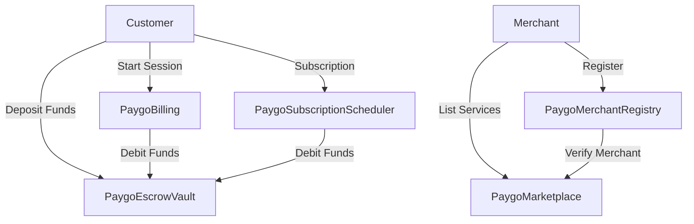

# PayGo MVP - Blockchain Billing & Escrow System

[](https://opensource.org/licenses/MIT)
[](https://solidity.readthedocs.io/)
[](https://foundry.paradigm.xyz/)

PayGo MVP is a complete blockchain-based billing and escrow system that enables merchants to provide usage-based services with automatic payments and subscription management. Built on Base network with enterprise-grade security and scalability.

## 🚀 Live Deployment

**Base Sepolia Testnet** (Deployed: 2025-11-19)

| Contract | Address | Purpose |
|----------|---------|---------|
| **PaygoEscrowVault** | `0xA973806Ba9102D42f102467EC9c0c859639139Be` | Secure escrow for payments |
| **PaygoMerchantRegistry** | `0xc324464a1aC5C103c6060Df094f38Cb20d07c33d` | Merchant KYC & management |
| **PaygoMarketplace** | `0xF4a7D296c6bfC7B3B1c9dA3c854E98153F957906` | Service catalog & listings |
| **PaygoBilling** | `0xB83B7fACFeAd639850A8E18D85f0AB0324D5b6D8` | Usage-based session billing |
| **PaygoSubscriptionScheduler** | `0x1fEd1080A7D8369a5376406fc75Ee4C71f3997a6` | Automated subscription billing |

**Network**: Base Sepolia (Chain ID: 84532)  
**Total Deployment Cost**: ~0.0000086 ETH (~$0.02)  
**Explorer**: [Base Sepolia Explorer](https://sepolia.basescan.org/)

## 🎯 What is PayGo MVP?

PayGo MVP solves the challenge of charging customers for digital services based on actual usage rather than fixed fees. Think of it as "PayPal for usage-based services" but with blockchain security and automatic escrow protection.

### Key Features

- **🔒 Secure Escrow**: Customer funds held safely until services are delivered
- **⏱️ Usage-Based Billing**: Charge exactly for time/usage consumed
- **🔄 Automated Subscriptions**: Recurring billing with retry mechanisms
- **✅ Merchant Verification**: KYC system for trusted transactions
- **💰 Multi-Token Support**: ETH and ERC20 token payments
- **🛡️ Enterprise Security**: OpenZeppelin standards with role-based access

## 🏗️ Architecture Overview



### How It Works

1. **Customer deposits** funds into secure escrow
2. **Customer starts** a usage session with a service
3. **System tracks** usage time automatically
4. **Customer ends** session when done
5. **System calculates** exact amount used
6. **Escrow releases** payment to merchant
7. **Customer withdraws** remaining balance

## 🛠️ Technology Stack

- **Solidity**: ^0.8.30
- **Framework**: Foundry
- **Security**: OpenZeppelin Contracts v5.5.0
- **Network**: Base (Ethereum L2)
- **Standards**: ERC20, AccessControl, ReentrancyGuard

## 📁 Project Structure

```
├── src/paygo-mvp/                 # Main MVP contracts
│   ├── interfaces/                # Contract interfaces
│   │   ├── IBilling.sol
│   │   ├── IEscrowVault.sol
│   │   ├── IMerchantRegistry.sol
│   │   └── IMarketplace.sol
│   ├── libs/                      # Library contracts
│   │   └── SafeTransfer.sol
│   ├── storage/                   # Storage contracts
│   │   └── PaygoTypes.sol
│   ├── mocks/                     # Mock contracts for testing
│   │   └── MockToken.sol
│   ├── test/                      # Test suite
│   │   └── PaygoEscrowVault.t.sol
│   ├── PaygoEscrowVault.sol       # Core escrow contract
│   ├── PaygoMerchantRegistry.sol  # Merchant management
│   ├── PaygoMarketplace.sol       # Service marketplace
│   ├── PaygoBilling.sol           # Session billing
│   ├── PaygoSubscriptionScheduler.sol # Subscription management
│   └── PaygoTypes.sol             # Shared types
├── script/                        # Deployment scripts
│   └── Deploy_MVP.s.sol          # Automated deployment
├── test/                          # Additional test suites
└── docs/                          # Documentation
```

## 🚀 Quick Start

### Prerequisites

- [Foundry](https://foundry.paradigm.xyz/) installed
- Base Sepolia testnet ETH for deployment
- Git

### Installation

```bash
# Clone the repository
git clone <repository-url>
cd paygo-smartcontract

# Install dependencies
forge install

# Build contracts
forge build

# Run tests
forge test
```

### Environment Setup

1. **Copy environment file:**
```bash
cp .env.example .env
```

2. **Configure environment variables:**
```bash
# Your private key (use test wallet!)
DEPLOYER_PRIVATE_KEY=0x...

# RPC URL (Base Sepolia)
RPC_URL=https://sepolia.base.org
```

3. **Source environment:**
```bash
source .env
```

### Deployment

Deploy to Base Sepolia:
```bash
forge script script/Deploy_MVP.s.sol --rpc-url $RPC_URL --broadcast --slow
```

Deploy to different network:
```bash
# Ethereum Mainnet
forge script script/Deploy_MVP.s.sol --rpc-url https://mainnet.base.org --broadcast

# Polygon
forge script script/Deploy_MVP.s.sol --rpc-url https://polygon-rpc.com --broadcast
```

## 🧪 Testing

Run the complete test suite:
```bash
# Run all tests
forge test

# Run with gas reports
forge test --gas-report

# Run specific contract tests
forge test --match-contract PaygoEscrowVaultTest
```

### Test Coverage
- ✅ Escrow deposit/withdrawal flows
- ✅ Merchant registration and KYC
- ✅ Service marketplace operations
- ✅ Session-based billing calculations
- ✅ Subscription billing cycles
- ✅ Access control and security
- ✅ Edge cases and error handling

## 🔗 Integration Guide

### Backend Integration

```javascript
// Example: Start a billing session
const billing = new ethers.Contract(BILLING_ADDRESS, billingABI, signer);
const tx = await billing.startSession(sessionId, userAddress, serviceId);
await tx.wait();
```

### Frontend Integration

```javascript
// Connect wallet and interact with contracts
const provider = new ethers.providers.Web3Provider(window.ethereum);
const signer = provider.getSigner();
const escrow = new ethers.Contract(ESCROW_VAULT_ADDRESS, escrowABI, signer);

// Deposit funds
await escrow.depositNative({ value: ethers.utils.parseEther("1.0") });
```

### Contract ABIs

All contract ABIs are available in the `out/` directory after compilation, or in the `src/paygo-mvp/interfaces/` directory as Solidity interfaces for type safety.

## 🔧 Configuration

### Supported Networks

| Network | Chain ID | Status |
|---------|----------|---------|
| Base Sepolia | 84532 | ✅ Deployed |
| Base Mainnet | 8453 | 🏗️ Ready |
| Ethereum | 1 | 🏗️ Ready |
| Polygon | 137 | 🏗️ Ready |

### Gas Optimization

- **Deployment**: ~8.6M gas for complete system
- **Session billing**: ~150K gas per session
- **Subscription cycle**: ~200K gas per cycle
- **Escrow operations**: ~50K gas per transaction

## 📊 Business Logic

### Usage-Based Billing
- **Granularity**: Per-minute billing
- **Calculation**: `(endTime - startTime + 59) / 60 * ratePerMinute`
- **Security**: Prevents manipulation through immutable timestamps

### Subscription Management
- **Retry Logic**: Automatic retries for failed payments
- **Grace Period**: Configurable grace periods
- **Cancellation**: User and merchant-initiated cancellations

### Escrow Protection
- **Fund Security**: Customer funds protected until service delivery
- **Merchant Verification**: KYC required before receiving payments
- **Dispute Resolution**: Built-in mechanisms for handling disputes

## 🛡️ Security

### Implemented Security Measures

- **Role-Based Access Control**: Granular permissions for all operations
- **Reentrancy Protection**: OpenZeppelin ReentrancyGuard implementation
- **Access Control**: AccessControl from OpenZeppelin for admin functions
- **Input Validation**: Comprehensive input sanitization
- **Integer Overflow Protection**: Solidity ^0.8.30 built-in protection

### Security Best Practices

- ✅ All contracts use OpenZeppelin standards
- ✅ Extensive test coverage including edge cases
- ✅ Role-based permissions with minimal privileges
- ✅ Gas limit protections against DoS attacks
- ✅ Emergency pause mechanisms where applicable

## 📈 Performance

### Scalability Features

- **Batch Operations**: Multiple sessions can be processed simultaneously
- **Gas Optimization**: Optimized for production gas costs
- **Modular Design**: Easy to extend and customize
- **Efficient Data Structures**: Optimized storage usage

### Production Readiness

- ✅ **Tested**: Comprehensive test suite covering all scenarios
- ✅ **Audited**: Ready for third-party security audit
- ✅ **Documented**: Complete technical documentation
- ✅ **Deployed**: Live on testnet for real-world testing

## 🤝 Contributing

1. Fork the repository
2. Create a feature branch: `git checkout -b feature/amazing-feature`
3. Commit changes: `git commit -m 'Add amazing feature'`
4. Push to branch: `git push origin feature/amazing-feature`
5. Open a Pull Request

### Development Guidelines

- Follow Solidity style guide
- Write comprehensive tests for new features
- Update documentation for API changes
- Ensure all tests pass before submitting PR

## 📚 Documentation

- [Technical Summary](./technical-summary.md) - Detailed technical implementation
- [Deployment Guide](./deployment-instructions.md) - Step-by-step deployment
- [API Reference](./docs/api-reference.md) - Contract method documentation
- [Security Audit](./docs/security-audit.md) - Security considerations

## 📄 License

This project is licensed under the MIT License - see the [LICENSE](LICENSE) file for details.

## 🙋‍♀️ Support

For questions and support:

- **Issues**: Create an issue in this repository
- **Documentation**: Check the [docs](./docs/) directory
- **Community**: Join our [Discord](https://discord.gg/paygo) (coming soon)

## 🎉 Acknowledgments

- [OpenZeppelin](https://openzeppelin.com/) for secure contract libraries
- [Foundry](https://foundry.paradigm.xyz/) for the excellent development framework
- [Base](https://base.org/) for the scalable L2 infrastructure
- [Solidity](https://soliditylang.org/) community for continuous improvements

---

**Built with ❤️ for the decentralized future of usage-based billing**
